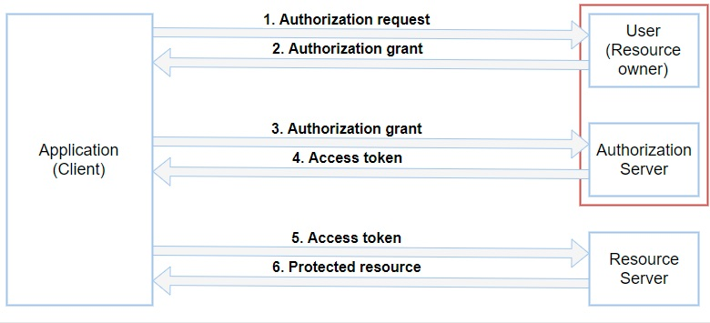

## JWT OAuth2 with Spring Boot

1. ### What is Spring Security?
       Spring Security is a framework focused on providingauthentication and authorization to Spring-based applications.
2. ### What is OAuth2?
       OAuth2 is an authorization framework to enable a third-party application to obtain limited access to an HTTP service through
       the sharing of an access token. Its specification supersedes and obsoletes OAuth 1.0 protocol
2. ### What is JWT?
       JWT stands for JSON Web Token, a specification for the representation of claims to be transferred between two parties.
       The claims are encoded as a JSON object used as the payload of an encrypted structure which enablesthe claims to be digitally signed or encrypted.

   
   

### The abstract OAuth 2.0 flow illustrated in Figure 1 describes the interaction between the four roles and includes the following steps:
    
    (1)  The client requests authorization from the resource owner.  The authorization request can be made directly to the resource owner (as shown), or preferably indirectly via
    the authorization server as an intermediary.
    
    (2)  The client receives an authorization grant, which is a credential representing the resource owner's authorization,expressed using one of four grant types defined in this
    specification or using an extension grant type.  The authorization grant type depends on the method used by the client to request authorization and the types supported by the
    authorization server.
    
    (3)  The client requests an access token by authenticating with the authorization server and presenting the authorization grant.
    
    (4)  The authorization server authenticates the client and validates the authorization grant, and if valid, issues an access token.
    
    (5)  The client requests the protected resource from the resource server and authenticates by presenting the access token.
    
    (6)  The resource server validates the access token, and if valid, serves the request.

### . OAuth2 (authorization server/resource owner and resource server)
    The app acts both as OAuth2 authorization server/resource owner and as resource server.
    The protected resources (as resource server) are published under /api/ path, while authentication path
    (as resource owner/authorization server) is mapped to /oauth/token, following proposed default.
#### Document working............

### Document Reference

- **Document Link :** [Spring Security, OAuth2, JWT](https://www.toptal.com/spring/spring-boot-oauth2-jwt-rest-protection)
  **And** [oauth2-abstract-flow-diagram](https://www.rfc-editor.org/rfc/rfc6749)
